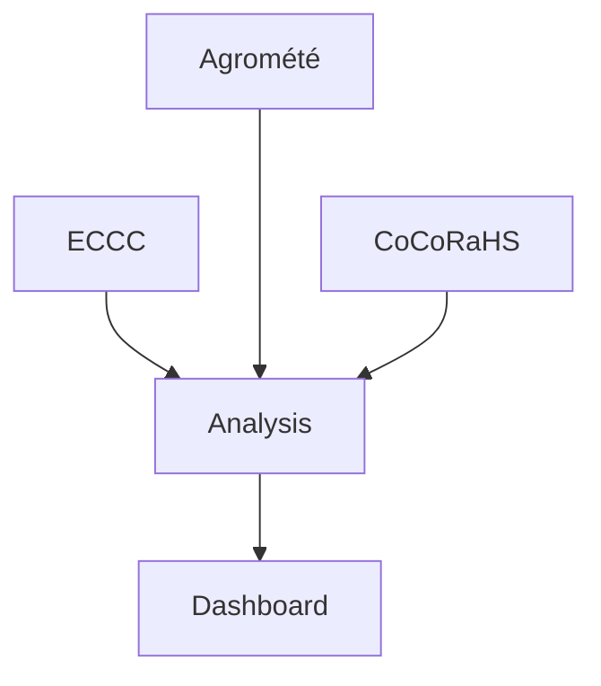

# ClimateDashboard

## Section 1

The goal is to retrieve various source of climate data, analyse them and create a dashboard in which we can navigate through the analyzed data.

### Data source
Here are the various data source used for the climate dataset  
- [ECCC datamart climate data](https://dd.weather.gc.ca/climate/)  
- [Agrométéo Québec](https://www.agrometeo.org/index.php/weather/local)  
- [CoCoRaHS](https://maps.cocorahs.org/)  

<!-- Hidden content -->

| Comand       | Description                                    |
| `git clone`  | Making a copy of the remote repository locally |
| `git status` | List all new, removed or modified files        |

Here is a code block
```
git clone
git status
```
Here is a python code block
```python
var = 5
print(var)
```


Here is a simple flow chart:

